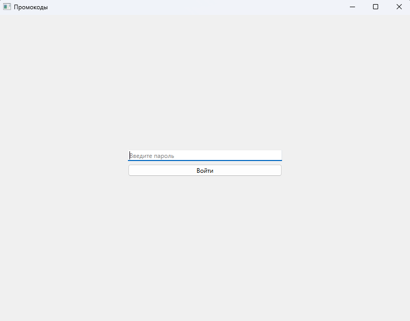
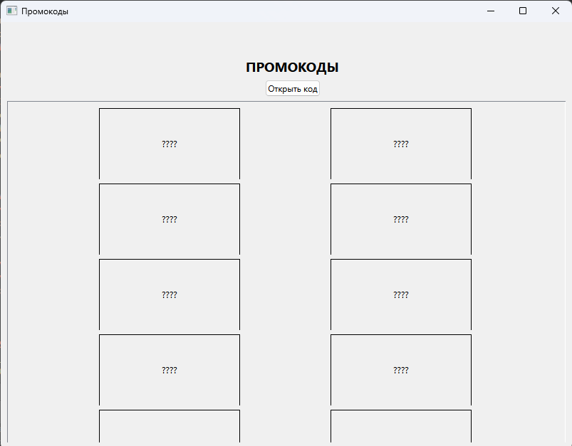
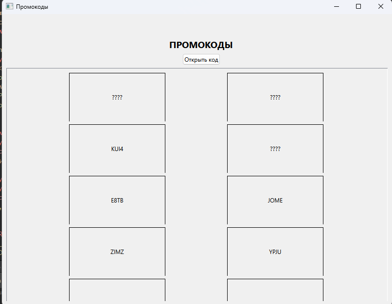

# Приложение для генерации и показа промо-кодов

### Описание приложения для выдачи промо-кодов и защиты данных

Приложение предназначено для выдачи случайных промо-кодов с применением защитных мер против атак злоумышленников на хранилище данных. Оно состоит из двух основных компонентов: страницы авторизации и страницы с промо-кодами. Приложение обеспечивает надёжную защиту данных с использованием шифрования алгоритмом AES-256 и управлением доступом через PIN-код.

### Шифрование промо-кодов:

-   Промокоды генерируются случайным образом и сразу шифруются с использованием алгоритма AES-256.
-   Для генерации ключа шифрования используется хэш вводимого пользователем PIN-кода, что обеспечивает дополнительный уровень безопасности.
-   Расшифровка промокода и его отображение происходят исключительно при нажатии на кнопку "Открыть промокод".

### Скриншоты

